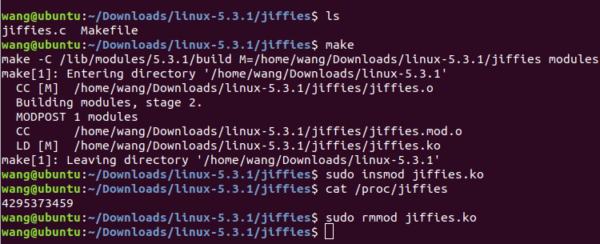
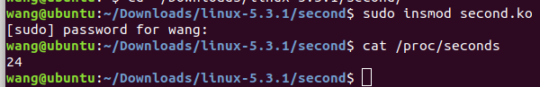

# Lab 1: Introduction to Linux Kernel Modules
<center> 517030910382 王逸雄 </center>

---
## Assignment
-  Design a kernel module that creates a /proc file named /proc/jiffies that reports the current value of jiffies when the /proc/jiffies file is read, such as with the command
    ```shell
    cat /proc/jiffies
    ```
- Design a kernel module that creates a proc file named /proc/seconds that reports the number of elapsed seconds since the kernel module was loaded. This will involve using the value of jiffies as well as the HZ rate. When a user enters the command
    ``` shell
    cat /proc/seconds
    ```
    your kernel module will report the number of seconds that have elapsed since the kernel module was first loaded. Be sure to remove /proc/seconds when the module is removed.
---
## Solution
To solve the two problems, we need to write C codes, compile them and load them into the current kernel. Before dealing with the assignments, I reloaded the linux kernel. During this process, I installed many application packages, some of which are useful in the assignments above.
### Environment
- OS: ubuntu-18.04
- kernel: 5.3.1
- virtual environment: VMware Workstation 15 pro

### Folder Structure
The assignments are written in two separated folders with the same structure.

Before compiling:
> Folder
>> - c source file
>> - Makefile

After compiling:
> Folder
>> - c source file
>> - Makefile
>> - .ko file
>> - .mod file
>> - .mod.c file
>> - .symvers file
>> - .order file

### Makefile
The assignments require 'make' to generate .ko file which is loaded into the kernel. A 'Makefile' is thus necessary. The files I used in this project are modified from the following template:
```Makefile
obj-m:=<MODULE_NAME>.o
simplemodule-objs:=module
KDIR:=/lib/modules/$(shell uname -r)/build
MAKE:=make
default:
	$(MAKE) -C $(KDIR) M=$(PWD) modules
clean:
	$(MAKE) -C $(KDIR) M=$(PWD) clean
```

### Assignment 1
#### method and code
Referring to the codes provided in <i>Operating System Concepts, 10th Edition</i> P-5 and P-6. I modified the codes in the  <i>proc\_read</i> function:
```C
ssize_t proc_read(struct file *file, char __user *usr_buf,
size_t count, loff_t *pos)
{
	int rv = 0;
	char buffer[BUFFER_SIZE];
	static int completed = 0;
	if (completed) {
		completed = 0;
		return 0;
	}
	completed = 1;
	rv = sprintf(buffer, "%lu\n", jiffies);
	/* copies kernel space buffer to user space usr buf */
	copy_to_user(usr_buf, buffer, rv);
	return rv;
}
```
This function can print the value of jiffies with the command
```shell
cat /proc/jiffies
```

#### result


### Assignment 2
#### method and code
In this assignment, we are required to report the number of elapsed seconds since the kernel module was loaded. I used a global variable $t$ to store the initial jiffies value when the module is loaded for the first time. Obviously, this happens in the initial process. Similarly, in the <i>proc\_read</i> function, we print the value of the seconds, which follows the equation 
> seconds = (jiffies - t) / Hz

The definition of global variable t.
```C
unsigned long int t = 0;
```
The initialization of t:

```C
int proc_init(void)
{
/* creates the /proc/jiffies entry */
	proc_create(PROC_NAME, 0666, NULL, &proc_ops);
	t = jiffies;
	return 0;
}
```
Calculation of elapsed seconds.
```C
ssize_t proc_read(struct file *file, char __user *usr_buf,
size_t count, loff_t *pos)
{
	int rv = 0;
	char buffer[BUFFER_SIZE];
	static int completed = 0;
	if (completed) {
		completed = 0;
		return 0;
	}
	completed = 1;
	rv = sprintf(buffer, "%lu\n", (jiffies-t)/HZ);
	/* copies kernel space buffer to user space usr buf */
	copy_to_user(usr_buf, buffer, rv);
	return rv;
}
```
#### result

